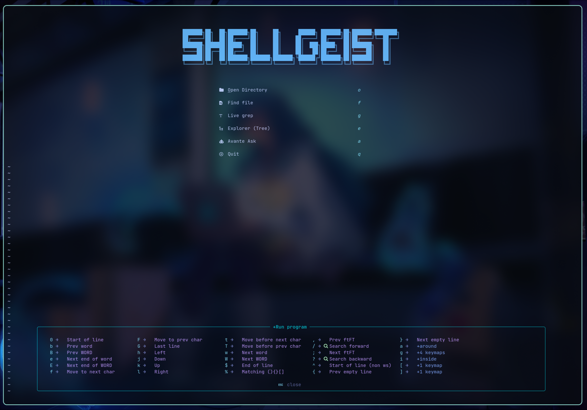
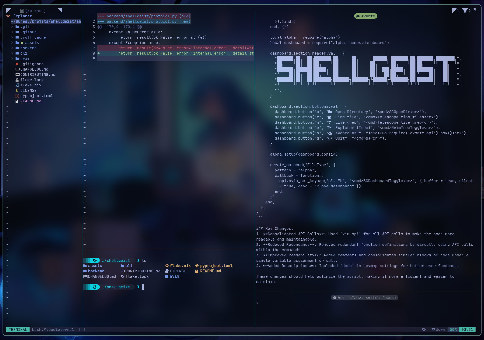

<div align="center">

  

  <p><strong>AI-powered code editing assistant for Neovim</strong></p>

</div>

<p align="center">

  <a href="https://neovim.io/" target="_blank"></a>

  <a href="https://www.python.org/" target="_blank"></a>

</p>

**ShellGeist** is a Neovim plugin that provides AI-driven code editing capabilities through a Unix socket daemon. It generates unified diffs using LLMs (compatible with OpenAI API, including Ollama) and applies them safely with comprehensive guardrails.

<p align="center">
  
</p>

<p align="center">
  
</p>

## Features

- **AI-Powered Code Editing**: Generate and apply code changes using LLM-generated unified diffs
- **Safe Patch Application**: Comprehensive guardrails prevent dangerous rewrites and syntax errors
- **Neovim Integration**: Seamless integration via Unix socket RPC with intuitive keybindings
- **Robust Error Handling**: Fallback mechanisms from diff-based to full-text replacement when needed
- **Future Import Protection**: Automatic preservation of Python `__future__` imports
- **Git Integration**: Built-in git status, staging, and restore commands

## Architecture

ShellGeist follows a client-server architecture:

- **Backend Daemon** (`sgd.py`): Async Unix socket server handling RPC requests
- **Neovim Plugin** (`nvim/`): Lua client with diff preview and keybindings
- **CLI Tool** (`cli/sg.py`): Command-line interface for debugging and testing

## Installation

### Prerequisites

- Neovim 0.9+
- Python 3.11+
- Ollama (or compatible OpenAI API endpoint)

### Setup

1. **Install the plugin** (using your preferred Neovim package manager):

```lua
-- lazy.nvim example
{
  "your-username/shellgeist",
  build = "pip install -e .",
  -- ... other config
}
```

2. **Configure environment variables**:

```bash
export OPENAI_BASE_URL="http://127.0.0.1:11434/v1"  # Ollama default
export OPENAI_API_KEY="ollama"
export SHELLGEIST_MODEL_FAST="deepseek-coder:6.7b"
export SHELLGEIST_MODEL_SMART="deepseek-coder-v2:16b-lite-instruct-q4_K_M"
```

3. **Start the daemon**:

```bash
python -m shellgeist.sgd
```

Or use the CLI:

```bash
sg debug  # Check environment
```

## Usage

### Neovim Commands

| Command | Description |
|---------|-------------|
| `:SGEdit <file> <instruction>` | Generate and preview a diff for editing a file |
| `:SGStatus` | Show git status |
| `:SGPlan <goal>` | Generate a plan for a goal (placeholder) |
| `:SGShell <task>` | Plan shell commands for a task (placeholder) |
| `:SGPing` | Test daemon connectivity |

### Diff Preview Keybindings

When viewing a diff preview:

- `a` - Apply patch
- `F` - Apply full replace
- `s` - Stage file in git
- `R` - Restore file from git
- `q` - Close (reject)

### CLI Usage

```bash
# Debug environment
sg debug

# Generate edit plan (returns JSON)
sg edit-plan <file> "<instruction>"
```

## Configuration

### Environment Variables

- `OPENAI_BASE_URL`: API endpoint (default: `http://127.0.0.1:11434/v1`)
- `OPENAI_API_KEY`: API key (default: `"ollama"`)
- `SHELLGEIST_MODEL_FAST`: Fast model for quick operations
- `SHELLGEIST_MODEL_SMART`: Smart model for complex edits
- `SHELLGEIST_TRACE=1`: Enable debug tracing
- `SHELLGEIST_HTTP_TIMEOUT`: HTTP timeout in seconds (default: 120)

### Neovim Configuration

```lua
require("shellgeist").setup({
  socket = vim.fn.expand("~/.cache/shellgeist.sock"),  -- Default socket path
})
```

## Guardrails

ShellGeist includes multiple safety mechanisms:

- **Control Character Blocking**: Prevents injection of control characters
- **Future Import Protection**: Ensures Python `__future__` imports remain at the top
- **Rewrite Detection**: Blocks violent rewrites (>80% change) unless explicitly requested
- **README Protection**: Stricter rules for README.md files (90% similarity required)
- **Syntax Validation**: Validates Python syntax after edits
- **Path Safety**: Prevents path traversal attacks

## Protocol

The daemon communicates via JSON-RPC over Unix sockets. Supported commands:

- `ping` - Health check
- `git_status` - Get git repository status
- `git_add` - Stage a file
- `git_restore` - Restore a file
- `edit` - Generate edit plan (diff)
- `edit_apply` - Apply a patch
- `edit_apply_full` - Apply full file replacement
- `plan` - Generate a plan (placeholder)
- `shell` - Plan shell commands (placeholder)

## Development

### Project Structure

```
shellgeist/
├── backend/
│   └── shellgeist/
│       ├── tools/        # Core modules (coder, planner, reviewer, shell)
│       ├── diff/         # Patch application and guards
│       ├── protocol.py   # RPC handler
│       ├── models.py     # LLM client
│       └── sgd.py        # Daemon entry point
├── cli/
│   └── sg.py             # CLI tool
├── nvim/                 # Neovim plugin
└── tests/                # Test suite
```

### Running Tests

```bash
pytest backend/tests/
```

### Building

```bash
pip install -e .
```

## License

See [LICENSE](./LICENSE) file for details.

## Contributing

Contributions are welcome! Please ensure your code follows the project's style and includes appropriate tests.
