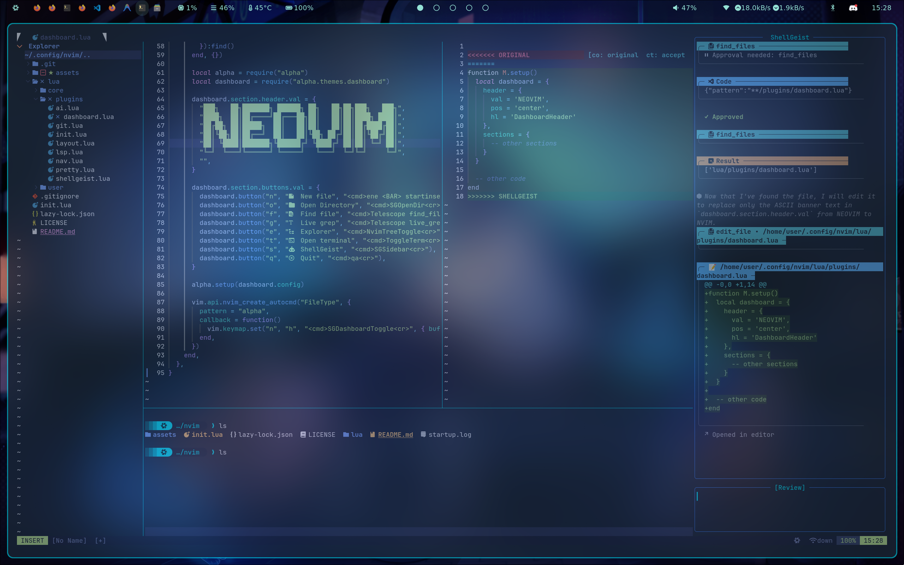
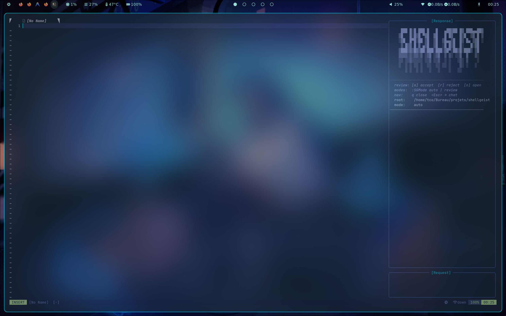
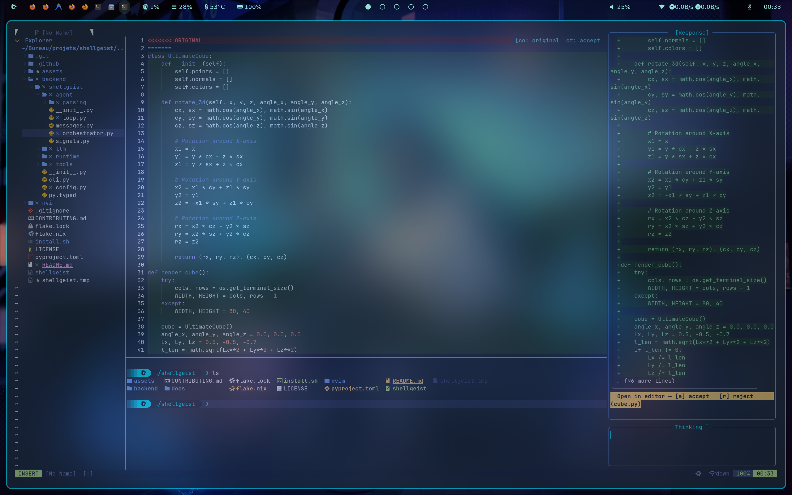
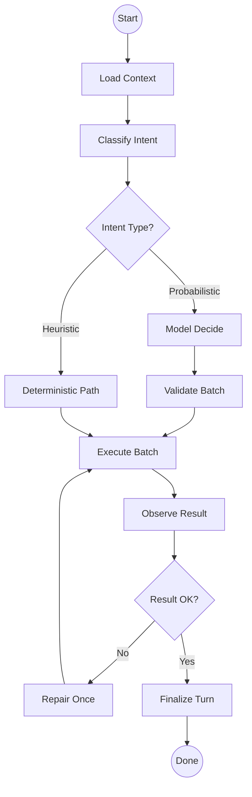
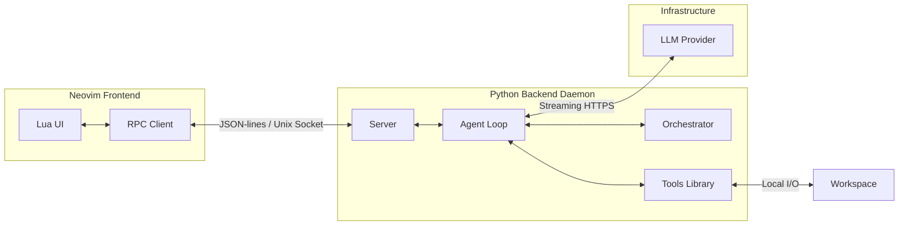

<div align="center">

<pre>
  ██████  ██░ ██ ▓█████  ██▓     ██▓      ▄████ ▓█████  ██▓  ██████ ▄▄▄█████▓
▒██    ▒ ▓██░ ██▒▓█   ▀ ▓██▒    ▓██▒     ██▒ ▀█▒▓█   ▀ ▓██▒▒██    ▒ ▓  ██▒ ▓▒
░ ▓██▄   ▒██▀▀██░▒███   ▒██░    ▒██░    ▒██░▄▄▄░▒███   ▒██▒░ ▓██▄   ▒ ▓██░ ▒░
  ▒   ██▒░▓█ ░██ ▒▓█  ▄ ▒██░    ▒██░    ░▓█  ██▓▒▓█  ▄ ░██░  ▒   ██▒░ ▓██▓ ░ 
▒██████▒▒░▓█▒░██▓░▒████▒░██████▒░██████▒░▒▓███▀▒░▒████▒░██░▒██████▒▒  ▒██▒ ░ 
▒ ▒▓▒ ▒ ░ ▒ ░░▒░▒░░ ▒░ ░░ ▒░▓  ░░ ▒░▓  ░ ░▒   ▒ ░░ ▒░ ░░▓  ▒ ▒▓▒ ▒ ░  ▒ ░░   
░ ░▒  ░ ░ ▒ ░▒░ ░ ░ ░  ░░ ░ ▒  ░░ ░ ▒  ░  ░   ░  ░ ░  ░ ▒ ░░ ░▒  ░ ░    ░    
░  ░  ░   ░  ░░ ░   ░     ░ ░     ░ ░   ░ ░   ░    ░    ▒ ░░  ░  ░    ░      
      ░   ░  ░  ░   ░  ░    ░  ░    ░  ░      ░    ░  ░ ░        ░           
</pre>

<p align="center">
  <a href="https://github.com/RomeoCavazza/shellgeist/blob/main/LICENSE"></a>
  <a href="https://www.python.org/downloads/"></a>
  <a href="https://neovim.io/"></a>
  <a href="https://www.lua.org/"></a>
  <a href="https://nixos.org/"></a>
  <a href="https://github.com/ollama/ollama"></a>
</p>

<p align="center">
  
</p>

---

[Overview](#overview) • [Preview](#preview) • [Project structure](#project-structure) • [Research & Logic](#research--logic) • [Architecture](#architecture) • [Commands](#commands) • [License](#license)

</div>

## Overview

ShellGeist is an **academic-grade AI code assistant** for Neovim, designed as both a high-performance productivity tool and an **object of study** for agentic workflows. It bridges the gap between Large Language Models and local development environments by providing a robust, auditable, and tool-augmented execution loop.

- **Hybrid Core**: Python-based daemon (processing) + Lua Neovim plugin (UI).
- **Agentic Autonomy**: Advanced logic for intent classification, deterministic shortcuts, and self-repairing loops.
- **Academic Standards**: Clean modular architecture, complete technical specifications, and reproducible environments via Nix.

### Project Structure

```text
.
├── assets/         # Brand identity and media
├── backend/        # Agent engine (Logic, Parsing, Tools)
├── docs/           # Academic & Technical Documentation
├── nvim/           # Neovim Lua plugin
├── flake.nix       # Reproducible dev environment
└── shellgeist      # Main CLI wrapper
```

> [!IMPORTANT]
> For in-depth analysis of functions, state variables, and design patterns, refer to the [Technical Documentation Portal](docs/README.md).

---

## Preview

Check out ShellGeist in action through these different lenses.





---

## Research & Logic

As an **object of study**, ShellGeist focuses on the reliability of model-driven tool usage. The agent implements a sophisticated decision pipeline to handle various intent types and error recovery.

### Agent Decision Pipeline


```mermaid
graph TD
    Start((Start)) --> LC[Load Context]
    LC --> CI[Classify Intent]
    CI --> IsModel{Intent Type?}
    
    IsModel -->|Probabilistic| MD[Model Decide]
    MD --> VB[Validate Batch]
    
    IsModel -->|Heuristic| DP[Deterministic Path]
    
    VB --> EB[Execute Batch]
    DP --> EB
    
    EB --> OR[Observe Result]
    OR --> IsSuccess{Result OK?}
    
    IsSuccess -->|No| RO[Repair Once]
    RO --> EB
    
    IsSuccess -->|Yes| FT[Finalize Turn]
    FT --> Done((Done))
```

---

## Architecture

ShellGeist utilizes a decentralized architecture where the UI is decoupled from the cognitive agent loop.


```mermaid
graph LR
    subgraph NV [Neovim Frontend]
        UI[Lua UI] <--> RPC[RPC Client]
    end
    
    subgraph BE [Python Backend Daemon]
        Server[Server] <--> Agent[Agent Loop]
        Agent <--> Orch[Orchestrator]
        Agent <--> Tools[Tools Library]
    end
    
    subgraph EX [Infrastructure]
        LLM[LLM Provider]
    end

    RPC <-->|JSON-lines / Unix Socket| Server
    Agent <-->|Streaming HTTPS| LLM
    Tools <-->|Local I/O| WS[Workspace]
```

---

## Commands

| Command | Description |
|--------|-------------|
| `shellgeist` / `sgd` | Start the backend daemon. |
| `:SGSidebar` | Toggle the chat/audit sidebar. |
| `:SGAgent` | Trigger an agentic task workflow. |
| `:SGMode auto/review` | Switch between autonomous and supervised mode. |

**Setup**  
```bash
# Using Nix (Recommended)
nix develop --command shellgeist

# Using Pip
pip install -e . && shellgeist
```

---

## License

[MIT](LICENSE)