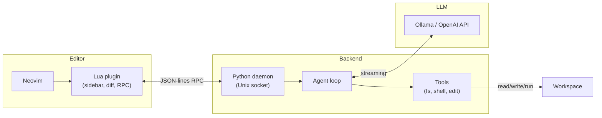
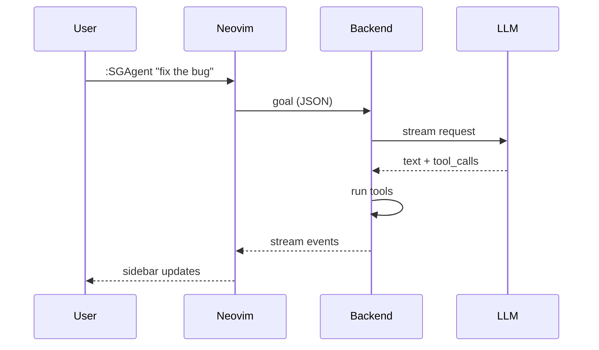
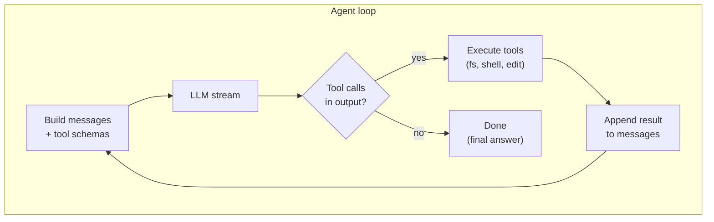

<div align="center">

<pre>
  ██████  ██░ ██ ▓█████  ██▓     ██▓      ▄████ ▓█████  ██▓  ██████ ▄▄▄█████▓
▒██    ▒ ▓██░ ██▒▓█   ▀ ▓██▒    ▓██▒     ██▒ ▀█▒▓█   ▀ ▓██▒▒██    ▒ ▓  ██▒ ▓▒
░ ▓██▄   ▒██▀▀██░▒███   ▒██░    ▒██░    ▒██░▄▄▄░▒███   ▒██▒░ ▓██▄   ▒ ▓██░ ▒░
  ▒   ██▒░▓█ ░██ ▒▓█  ▄ ▒██░    ▒██░    ░▓█  ██▓▒▓█  ▄ ░██░  ▒   ██▒░ ▓██▓ ░ 
▒██████▒▒░▓█▒░██▓░▒████▒░██████▒░██████▒░▒▓███▀▒░▒████▒░██░▒██████▒▒  ▒██▒ ░ 
▒ ▒▓▒ ▒ ░ ▒ ░░▒░▒░░ ▒░ ░░ ▒░▓  ░░ ▒░▓  ░ ░▒   ▒ ░░ ▒░ ░░▓  ▒ ▒▓▒ ▒ ░  ▒ ░░   
░ ░▒  ░ ░ ▒ ░▒░ ░ ░ ░  ░░ ░ ▒  ░░ ░ ▒  ░  ░   ░  ░ ░  ░ ▒ ░░ ░▒  ░ ░    ░    
░  ░  ░   ░  ░░ ░   ░     ░ ░     ░ ░   ░ ░   ░    ░    ▒ ░░  ░  ░    ░      
      ░   ░  ░  ░   ░  ░    ░  ░    ░  ░      ░    ░  ░ ░        ░           
</pre>

</div>

<p align="center">
  <a href="https://github.com/RomeoCavazza/shellgeist/blob/main/LICENSE"></a>
  <a href="https://www.python.org/downloads/"></a>
  <a href="https://neovim.io/"></a>
  <a href="https://www.lua.org/"></a>
  <a href="https://nixos.org/"></a>
  <a href="https://github.com/RomeoCavazza/shellgeist/actions"></a>
  <a href="https://github.com/ollama/ollama"></a>
  <a href="https://openai.com/api/"></a>
</p>

---

## Overview

ShellGeist is an AI-powered code assistant that runs inside Neovim. It connects your editor to an LLM backend (Ollama or any OpenAI-compatible API), runs tools in your workspace (read/write files, shell commands, diffs), and streams responses into a sidebar. Edit, review, and apply changes without leaving the buffer.

- **Daemon + plugin**: Python backend (Unix socket server) and Lua Neovim plugin; one process per workspace.
- **Tool-first**: The model calls tools (e.g. `list_files`, `read_file`, `run_shell`); you see results and can approve in review mode.
- **Streaming UI**: Chat sidebar with [Response] / [Request], inline diff review, and conflict resolution.

<p align="center">
  
</p>

*Screenshot: chat sidebar with request/response and tool outputs.*

---

## Project structure

Repository layout: Python backend (one package under `backend/shellgeist/`), Neovim plugin in `nvim/`, and top-level scripts for running the daemon.

**Prerequisites:** Python 3.11+, Neovim 0.9+, [nui.nvim](https://github.com/MunifTanjim/nui.nvim) (required for the sidebar), Ollama or OpenAI-compatible API.

```
.
├── assets
│   ├── ascii-logo.txt
│   └── shellgeist.png
├── backend
│   └── shellgeist
│       ├── __init__.py
│       ├── cli.py
│       ├── config.py
│       ├── py.typed
│       ├── agent
│       │   ├── __init__.py
│       │   ├── loop.py
│       │   ├── messages.py
│       │   ├── orchestrator.py
│       │   ├── signals.py
│       │   └── parsing
│       │       ├── __init__.py
│       │       ├── json_utils.py
│       │       ├── normalize.py
│       │       └── parser.py
│       ├── llm
│       │   ├── __init__.py
│       │   ├── client.py
│       │   ├── prompt.py
│       │   ├── rules.py
│       │   └── stream.py
│       ├── runtime
│       │   ├── __init__.py
│       │   ├── paths.py
│       │   ├── policy.py
│       │   ├── protocol.py
│       │   ├── server.py
│       │   ├── session.py
│       │   ├── telemetry.py
│       │   └── transport.py
│       └── tools
│           ├── __init__.py
│           ├── base.py
│           ├── edit.py
│           ├── executor.py
│           ├── fs.py
│           ├── git_utils.py
│           ├── patch.py
│           └── shell.py
├── CONTRIBUTING.md
├── flake.lock
├── flake.nix
├── install.sh
├── LICENSE
├── nvim
│   ├── lua
│   │   └── shellgeist
│   │       ├── conflict.lua
│   │       ├── diff.lua
│   │       ├── init.lua
│   │       ├── rpc.lua
│   │       └── sidebar.lua
│   └── plugin
│       └── shellgeist.lua
├── pyproject.toml
├── README.md
└── shellgeist
```

---

## Architecture

High-level view: the editor talks to a single Python daemon over a Unix socket; the daemon runs the agent (LLM + tools) and streams events back.


```mermaid
flowchart LR
  subgraph Editor
    N["Neovim"]
    UI["Lua plugin\n(sidebar, diff, RPC)"]
    N --> UI
  end

  subgraph Backend
    S["Python daemon\n(Unix socket)"]
    A["Agent loop"]
    T["Tools\n(fs, shell, edit)"]
    S --> A
    A --> T
  end

  subgraph LLM
    O["Ollama / OpenAI API"]
  end

  UI <-->|"JSON-lines RPC"| S
  A <-->|"streaming"| O
  T -->|"read/write/run"| FS["Workspace"]
```

- Neovim plugin opens a Unix socket and sends JSON-lines (goal, mode). Backend runs the agent loop, calls tools, streams tool calls and results back. Plugin renders sidebar, tool cards, and diff review.

### Request flow

What happens when you run `:SGAgent "fix the bug"`: the goal is sent to the backend, which streams a request to the LLM; when the model returns text and tool calls, the backend runs the tools and streams events back so the sidebar updates in real time.


```mermaid
sequenceDiagram
  participant User
  participant Neovim
  participant Backend
  participant LLM

  User->>Neovim: :SGAgent "fix the bug"
  Neovim->>Backend: goal (JSON)
  Backend->>LLM: stream request
  LLM-->>Backend: text + tool_calls
  Backend->>Backend: run tools
  Backend-->>Neovim: stream events
  Neovim-->>User: sidebar updates
```

### Agent loop (backend)

Inside the backend, the agent repeatedly builds a message list (with tool schemas), calls the LLM, and either executes tool calls (then appends results and loops) or finishes with a final answer.


```mermaid
flowchart TB
  subgraph loop["Agent loop"]
    P["Build messages\n+ tool schemas"]
    L["LLM stream"]
    X{"Tool calls\nin output?"}
    E["Execute tools\n(fs, shell, edit)"]
    A["Append result\nto messages"]
    D["Done\n(final answer)"]

    P --> L
    L --> X
    X -->|yes| E
    E --> A
    A --> P
    X -->|no| D
  end
```

---

## Commands

Main Neovim commands and how to run the backend.

| Command | Description |
|--------|-------------|
| `shellgeist` / `sgd` | Start the daemon (or run one-off with args). |
| `:SGSidebar` | Toggle the chat sidebar. |
| `:SGAgent` / `:SGAgent <goal>` | With no args: open sidebar and focus the request input. With a goal: send the task and stream the response. |
| `:SGReview` | Open the review panel for current diff / conflicts. |
| `:SGEdit <file> <instruction>` | Edit a file with a natural-language instruction. |
| `:SGMode auto` / `:SGMode review` | Set auto vs manual tool approval. In **review** mode, write_file and edit_file show a diff card with [a] accept [r] reject [o] open before applying; in **auto** mode tools run immediately (no diff card). |

**Install (plugin)**  
Point your Neovim config to the `nvim/` directory (e.g. with lazy.nvim or as a local path). Ensure the `shellgeist` (or `install.sh`) script is on your `PATH` or that the daemon is started with `PYTHONPATH=backend python -m shellgeist.cli`.

**Run backend**

```bash
# With Nix
nix develop --command shellgeist

# Or venv + pip
pip install -e .
shellgeist
```


## Contributing

Contributions are welcome. See [CONTRIBUTING.md](CONTRIBUTING.md) for dev setup, linting, and the pull request process.

---

## License

[MIT](LICENSE)
