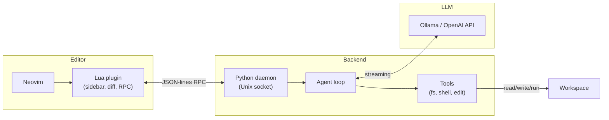

<p align="center">
<pre>
  ██████  ██░ ██ ▓█████  ██▓     ██▓      ▄████ ▓█████  ██▓  ██████ ▄▄▄█████▓
▒██    ▒ ▓██░ ██▒▓█   ▀ ▓██▒    ▓██▒     ██▒ ▀█▒▓█   ▀ ▓██▒▒██    ▒ ▓  ██▒ ▓▒
░ ▓██▄   ▒██▀▀██░▒███   ▒██░    ▒██░    ▒██░▄▄▄░▒███   ▒██▒░ ▓██▄   ▒ ▓██░ ▒░
  ▒   ██▒░▓█ ░██ ▒▓█  ▄ ▒██░    ▒██░    ░▓█  ██▓▒▓█  ▄ ░██░  ▒   ██▒░ ▓██▓ ░ 
▒██████▒▒░▓█▒░██▓░▒████▒░██████▒░██████▒░▒▓███▀▒░▒████▒░██░▒██████▒▒  ▒██▒ ░ 
▒ ▒▓▒ ▒ ░ ▒ ░░▒░▒░░ ▒░ ░░ ▒░▓  ░░ ▒░▓  ░ ░▒   ▒ ░░ ▒░ ░░▓  ▒ ▒▓▒ ▒ ░  ▒ ░░   
░ ░▒  ░ ░ ▒ ░▒░ ░ ░ ░  ░░ ░ ▒  ░░ ░ ▒  ░  ░   ░  ░ ░  ░ ▒ ░░ ░▒  ░ ░    ░    
░  ░  ░   ░  ░░ ░   ░     ░ ░     ░ ░   ░ ░   ░    ░    ▒ ░░  ░  ░    ░      
      ░   ░  ░  ░   ░  ░    ░  ░    ░  ░      ░    ░  ░ ░        ░           
</pre>
</p>

<p align="center">
  
</p>

<p align="center">
  <a href="https://github.com/RomeoCavazza/shellgeist/blob/main/LICENSE"></a>
  <a href="https://www.python.org/downloads/"></a>
  <a href="https://neovim.io/"></a>
  <a href="https://www.lua.org/"></a>
  <a href="https://nixos.org/"></a>
  <a href="https://github.com/RomeoCavazza/shellgeist/actions"></a>
  <a href="https://github.com/ollama/ollama"></a>
  <a href="https://openai.com/api/"></a>
</p>

---

## Overview

ShellGeist is an AI-powered code assistant that runs inside Neovim. It connects your editor to an LLM backend (Ollama or any OpenAI-compatible API), runs tools in your workspace (read/write files, shell commands, diffs), and streams responses into a sidebar. Edit, review, and apply changes without leaving the buffer.

- **Daemon + plugin**: Python backend (Unix socket server) and Lua Neovim plugin; one process per workspace.
- **Tool-first**: The model calls tools (e.g. `list_files`, `read_file`, `run_shell`); you see results and can approve in review mode.
- **Streaming UI**: Chat sidebar with [Response] / [Request], inline diff review, and conflict resolution.

---

## Project structure

```
shellgeist/
├── backend/
│   └── shellgeist/
│       ├── cli.py              # CLI and daemon entry
│       ├── config.py           # Env and config
│       ├── agent/              # Agent loop, orchestration, parsing
│       ├── llm/                # Client, prompt, streaming
│       ├── runtime/            # Server, protocol, session, policy
│       └── tools/              # read_file, write_file, list_files, shell, edit, patch, git
├── nvim/
│   ├── plugin/shellgeist.lua   # Plugin loader
│   └── lua/shellgeist/
│       ├── init.lua            # Commands, event dispatch
│       ├── sidebar.lua         # Chat UI (nui.nvim)
│       ├── rpc.lua             # Unix socket RPC client
│       ├── diff.lua            # Diff preview and apply
│       └── conflict.lua         # Inline accept/reject
├── assets/
│   ├── ascii-logo.txt
│   └── shellgeist.png
├── flake.nix                   # Nix flake (dev shell, run, build)
├── pyproject.toml              # Python package
├── install.sh                  # Wrapper (venv / nix develop / nix-shell)
└── shellgeist                  # Bash entry script
```

---

## Architecture


```mermaid
flowchart LR
  subgraph Editor
    N["Neovim"]
    UI["Lua plugin\n(sidebar, diff, RPC)"]
    N --> UI
  end

  subgraph Backend
    S["Python daemon\n(Unix socket)"]
    A["Agent loop"]
    T["Tools\n(fs, shell, edit)"]
    S --> A
    A --> T
  end

  subgraph LLM
    O["Ollama / OpenAI API"]
  end

  UI <-->|"JSON-lines RPC"| S
  A <-->|"streaming"| O
  T -->|"read/write/run"| FS["Workspace"]
```

- Neovim plugin opens a Unix socket and sends JSON-lines (goal, mode). Backend runs the agent loop, calls tools, streams tool calls and results back. Plugin renders sidebar, tool cards, and diff review.

---

## Commands

| Command | Description |
|--------|-------------|
| `shellgeist` / `sgd` | Start the daemon (or run one-off with args). |
| `:SGChat` | Open the chat sidebar and focus the request input. |
| `:SGAgent <goal>` | Send a one-shot goal and stream the response. |
| `:SGReview` | Open the review panel for current diff / conflicts. |
| `:SGEdit <file> <instruction>` | Edit a file with a natural-language instruction. |
| `:SGMode auto` / `:SGMode review` | Set auto vs manual tool approval. |

**Install (plugin)**  
Point your Neovim config to the `nvim/` directory (e.g. with lazy.nvim or as a local path). Ensure the `shellgeist` (or `install.sh`) script is on your `PATH` or that the daemon is started with `PYTHONPATH=backend python -m shellgeist.cli`.

**Run backend**

```bash
# With Nix
nix develop --command shellgeist

# Or venv + pip
pip install -e .
shellgeist
```

---

## Contributing

Contributions are welcome. Please read [CONTRIBUTING.md](CONTRIBUTING.md) for setup, tests, linting, and the pull request process.

---

## License

[MIT](LICENSE)
