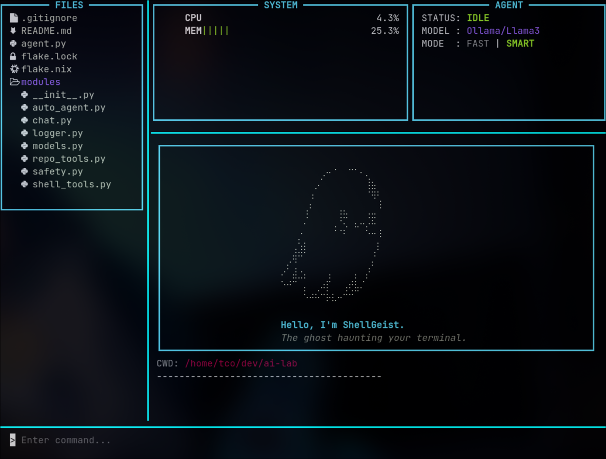

<div align="center">

  

  # ShellGeist 👻

  **The Ghost in Your Shell.**
  
  <p>
    
    
    
    
    
  </p>

  <p>
    <a href="#-features">Features</a> •
    <a href="#-getting-started">Getting Started</a> •
    <a href="#-commands">Commands</a> •
    <a href="#-configuration">Config</a>
  </p>

</div>

---

> **ShellGeist** is a transparent, cyberpunk Terminal User Interface (TUI) agent powered by LLMs. It haunts your terminal to help you code, navigate, and automate tasks without ever leaving your keyboard.



## ✨ Features

*   **👾 Cyberpunk Dashboard**
    *   A grid-based layout inspired by modern IDEs and sci-fi interfaces.
    *   **100% Transparent**: Seamlessly blends with your terminal wallpaper or blur.
    
*   **🧠 Dual Mode Brain**
    *   **FAST Mode**: Uses lightweight models (e.g., Mistral) for instant answers.
    *   **SMART Mode**: Switches to heavy-hitters (e.g., Llama3, GPT-4) for complex reasoning and planning.

*   **🤖 Autonomous Agent**
    *   **`/auto` Planner**: Breaks down high-level goals into executable steps.
    *   **`/edit` Coder**: Smart file editing with diff previews and safety checks.
    *   **`/sh` Executor**: Generates and runs shell commands safely.

*   **📊 Real-time Monitoring**
    *   Live CPU/RAM usage tracking.
    *   Reactive agent status indicators (IDLE, THINKING, PLANNING, CODING).

*   **🎨 Nerd Fonts Integration**
    *   Beautiful file icons and UI elements for a premium terminal experience.

---

## 🚀 Getting Started

### Prerequisites

*   **Python 3.11+**
*   **Nerd Font** installed in your terminal (required for icons).
*   **Ollama** running locally (default) OR an OpenAI-compatible API key.

### Installation

#### Option A: Nix

For a reproducible, isolated environment:

```bash
git clone https://github.com/RomeoCavazza/shellgeist.git
cd shellgeist
nix develop
# The environment is now ready!
```

#### Option B: Standard Pip

```bash
git clone https://github.com/RomeoCavazza/shellgeist.git
cd shellgeist
python -m venv .venv
source .venv/bin/activate
pip install -r requirements.txt
```

---

## 🎮 Usage

Run the agent to summon the ghost:

```bash
python agent.py
```

### Commands

| Command | Action | Description |
| :--- | :---: | :--- |
| **Chat** | `// <msg>` | Just type to chat with the AI (default behavior). |
| **Auto** | `/auto <goal>` | **Autonomous Mode**: Plans and executes complex tasks (edit + shell). |
| **Edit** | `/edit <file> <instr>` | Edit a specific file with instructions. Shows a diff before applying. |
| **Shell** | `/sh <task>` | Generate and run shell commands. |
| **List** | `/ls` | List files in the current directory with icons. |
| **Quit** | `/quit` | Banishes the ghost. |

---

## 🛠️ Configuration

You can toggle between **FAST** and **SMART** models directly in the UI by clicking the status panel.

To configure specific models via environment variables:

```bash
# Example configuration
export OPENAI_BASE_URL="http://127.0.0.1:11434/v1"  # Default to Ollama
export AI_MODEL_SMART="llama3"
export AI_MODEL_FAST="mistral"
```

## License

Distributed under the MIT License. See `LICENSE` for more information.
