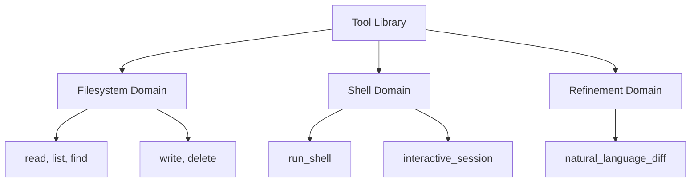
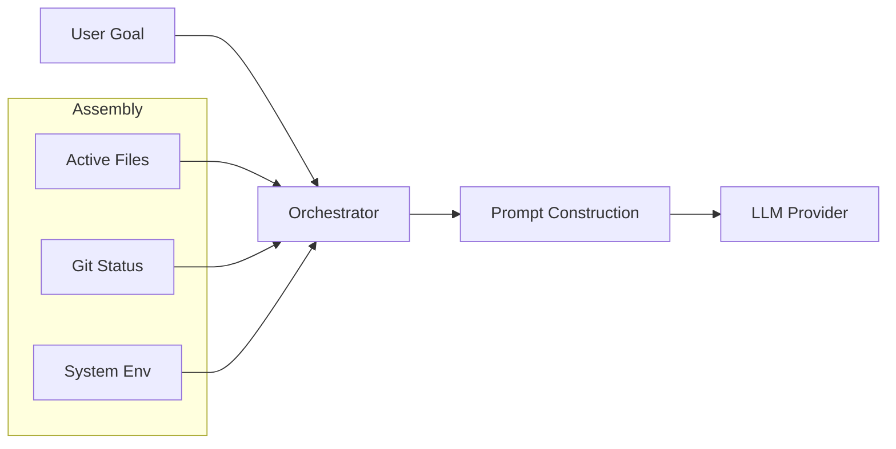
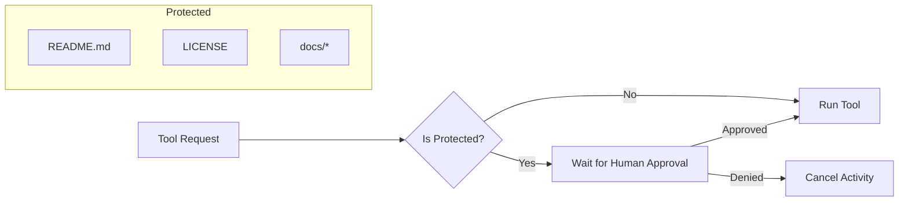
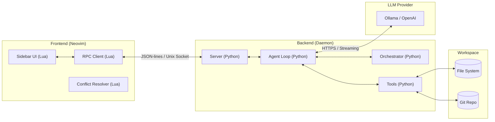
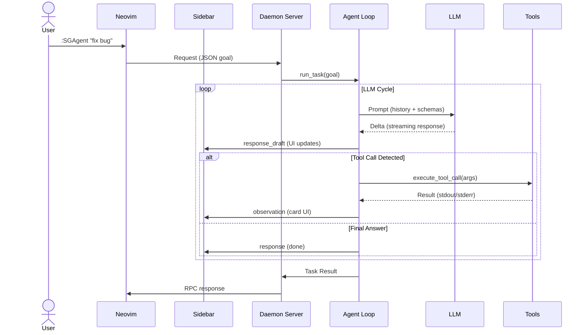

# Technical Documentation Portal

Welcome to the in-depth technical documentation for **ShellGeist**. This project is designed as both a high-performance productivity tool for Neovim and an **academic object of study** for agentic workflows.

---

## `docs/` Structure

```text
docs/
├── README.md           # This portal
├── cloc-report.md      # Code statistics (Generated by cloc)
├── specification.txt   # Dense technical dictionary
└── diagrams/           # Visual sources and exports
    ├── *.puml          # PlantUML sources (Archival)
    └── png/            # Image exports (.png)
```

---

## 1. Core Philosophy: The Object of Study

Unlike "black-box" AI assistants, ShellGeist is built on the principle of **Auditability**. It treats the agentic loop as a series of observable segments:

1.  **Intent Classification**: Deciding if the model is needed or if a heuristic can solve the task.
2.  **Deterministic Fallbacks**: Reducing token usage by mapping known patterns to fixed tool chains.
3.  **Self-Correction**: Detecting tool failures and attempting a repair turn before giving up.

### Tool Ecosystem Taxonomy
The agent's capabilities are partitioned into specialized domains to prevent tool-bloat and maintain a narrow focus.



---

## 2. Information Assembly (Context)

Before every model turn, the **Orchestrator** performs a context assembly to provide the agent with a consistent "worldview".



---

## 3. Safety & Verification (The Guardrails)

ShellGeist implements a "Safety Gate" logic to protect critical project files and ensure human supervision in sensitive operations.



---

## 4. Technical Dictionary

[**specification.txt**](./specification.txt) — A condensed view of architecture, key variables, backend and frontend modules, and agent logic flows.

---

## 5. Code Statistics (CLOC)

| Language | files | blank | comment | code |
| :--- | :--- | :--- | :--- | :--- |
| Python | 32 | 1148 | 664 | 5923 |
| Lua | 6 | 317 | 295 | 2774 |
| **SUM** | **38** | **1465** | **959** | **8697** |

Full report: [**cloc-report.md**](./cloc-report.md).

---

## 6. Architecture & Logic

### Agent Lifecycle
The following diagram details how the agent switches between probabilistic decisions and deterministic paths.


### System Architecture (Distributed)
Loose coupling between the Python daemon and the Lua plugin via Unix Domain Sockets.



### Execution Sequence
Typical data flow during a user request.


