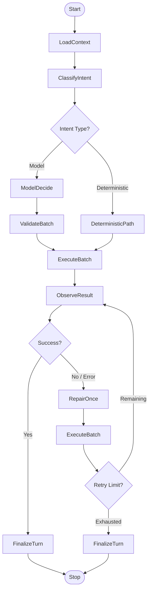
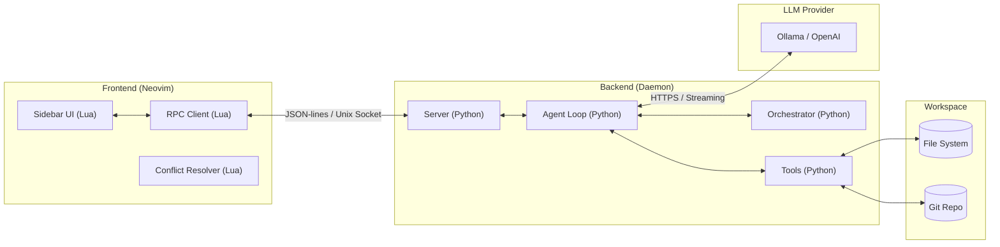
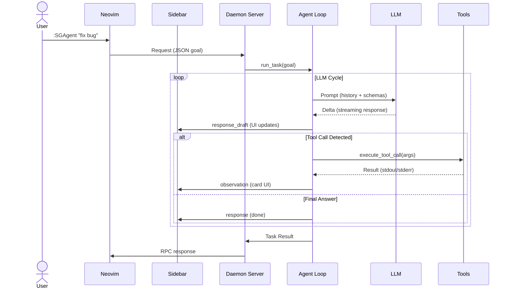

# Technical Documentation Portal

Welcome to the in-depth technical documentation for **ShellGeist**. This project is both a productivity tool for Neovim and an **object of study** for agentic workflows.

---

## `docs/` Structure

```text
docs/
├── README.md           # This portal
├── cloc-report.md      # Code statistics (Generated by cloc)
├── specification.txt   # Dense technical dictionary
└── diagrams/           # Visual sources and exports
    ├── *.puml          # PlantUML sources
    └── png/            # Image exports (.png)
```

---

## 1. Technical Dictionary

[**specification.txt**](./specification.txt) — A condensed view of architecture, key variables, backend and frontend modules, and agent logic flows.

---

## 2. Code Statistics (CLOC)

| Language | files | blank | comment | code |
| :--- | :--- | :--- | :--- | :--- |
| Python | 32 | 1148 | 664 | 5923 |
| Lua | 6 | 317 | 295 | 2774 |
| **SUM** | **38** | **1465** | **959** | **8697** |

> [!TIP]
> To regenerate this report:
> ```bash
> cloc . --exclude-dir=.git,node_modules,result,.direnv --md --out=docs/cloc-report.md
> ```

Full report: [**cloc-report.md**](./cloc-report.md).

---

## 3. Architecture & Logic

### Agent Lifecycle
The following diagram details how the agent switches between probabilistic decisions and deterministic paths.



### System Architecture
Loose coupling between the Python daemon and the Lua plugin.



### Execution Sequence
Typical data flow during a user request.



---

## 4. Diagrams (PlantUML)

Sources: `diagrams/*.puml`. Sources are kept for archival purposes, but the diagrams above use Mermaid for dynamic rendering.

To regenerate PNG images (optional):
```bash
nix shell nixpkgs#plantuml -c plantuml -tpng -odocs/diagrams/png docs/diagrams/*.puml
```
