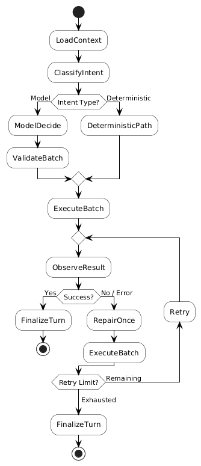
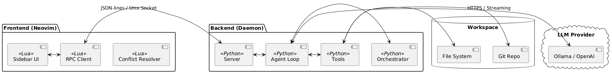

# ShellGeist Technical Documentation & Research

Bienvenue dans la documentation technique approfondie de ShellGeist. Ce projet n'est pas seulement un outil de productivité pour Neovim, mais un **objet d'étude** sur l'interaction entre les agents LLM (Large Language Models) et les environnements de développement locaux.

## Dimensions du Projet
- **Outil Opérationnel** : Extension de codage assisté par AI pour Neovim.
- **Projet Universitaire Open Source** : Conçu pour être modulaire, auditable et extensible par la communauté.
- **Objet d'Étude** : Analyse des comportements de "slope" (pente) du modèle, des mécanismes de réparation automatique et de la validation déterministe vs probabiliste.

---

## Sommaire
- [Spécifications Techniques](specification.txt)
- [Décision de l'Agent : Logique Profonde](#décision-de-lagent--logique-profonde)
- [Résultats CLOC](#résultats-cloc)
- [Architecture Globale](#architecture-globale)

---

## Décision de l'Agent : Logique Profonde

Le schéma suivant détaille le cycle de vie d'une requête, illustrant comment ShellGeist bascule entre des chemins déterministes (calculés) et des décisions de modèle (inférées), tout en intégrant une boucle de réparation (`RepairOnce`).



### Phases Clés
1.  **ClassifyIntent** : Détermination de la famille du but (Goal Family).
2.  **DeterministicPath** : Utilisation d'heuristiques pour les tâches triviales ou connues (ex: simples lectures).
3.  **ValidateBatch** : Garde-fou crucial avant l'exécution pour prévenir les actions destructrices.
4.  **ObserveResult & RepairOnce** : Mécanisme de bouclage permettant à l'agent de corriger ses propres erreurs de syntaxe ou d'exécution.

---

## Résultats CLOC

Statistiques du code source (générées le 13 Mars 2026) :

```text
Language                     files          blank        comment           code
-------------------------------------------------------------------------------
Python                          32           1148            664           5923
Lua                              6            317            295           2774
-------------------------------------------------------------------------------
SUM:                            38           1465            959           8697
```

---

## Architecture Globale

Le système repose sur un couplage lâche entre le Frontend (Lua) et le Backend (Daemon Python).


