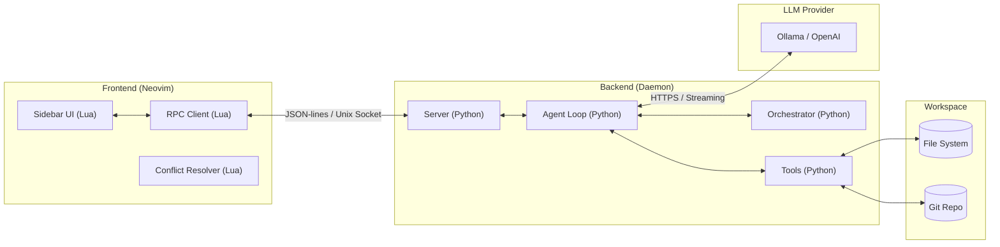
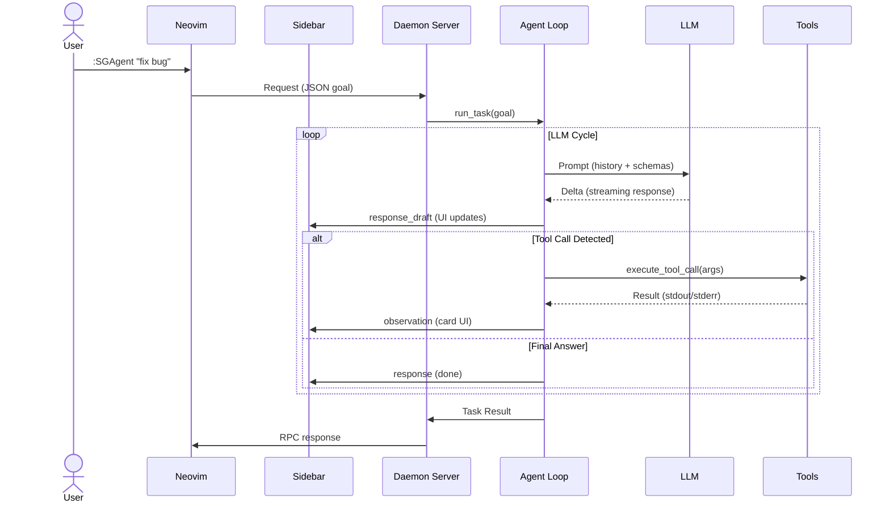

# Technical Documentation Portal

Bienvenue dans la documentation technique approfondie de **ShellGeist**. Ce projet est à la fois un outil de productivité pour Neovim et un **objet d'étude** sur les workflows agentiques.

---

## Structure de `docs/`

```text
docs/
├── README.md           # Ce portail
├── cloc-report.md      # Statistiques du code (Généré par cloc)
├── specification.txt   # Dictionnaire technique dense
└── diagrams/           # Sources et exports visuels
    ├── *.puml          # Sources PlantUML
    └── png/            # Exports images (.png)
```

---

## 1. Dictionnaire Technique

[**specification.txt**](./specification.txt) — Une vue condensée de l'architecture, des variables clés, des modules backend et frontend, et des flux logiques de l'agent.

---

## 2. Statistiques du Code (CLOC)

| Language | files | blank | comment | code |
| :--- | :--- | :--- | :--- | :--- |
| Python | 32 | 1148 | 664 | 5923 |
| Lua | 6 | 317 | 295 | 2774 |
| **SUM** | **38** | **1465** | **959** | **8697** |

> [!TIP]
> Pour régénérer ce rapport :
> ```bash
> cloc . --exclude-dir=.git,node_modules,result,.direnv --md --out=docs/cloc-report.md
> ```

Rapport complet : [**cloc-report.md**](./cloc-report.md).

---

## 3. Architecture & Logique

### Cycle de Vie de l'Agent
Le schéma suivant détaille comment l'agent bascule entre décisions probabilistes et chemins déterministes.


### Architecture Système
Couplage lâche entre le daemon Python et le plugin Lua.



### Séquence d'Éxécution
Flux de données typique lors d'une requête utilisateur.



---

## 4. Diagrammes (PlantUML)

Sources : `diagrams/*.puml`. Les sources sont conservées pour archive, mais les diagrammes ci-dessus utilisent Mermaid pour un rendu dynamique.

Pour régénérer les images PNG (optionnel) :
```bash
nix shell nixpkgs#plantuml -c plantuml -tpng -odocs/diagrams/png docs/diagrams/*.puml
```
